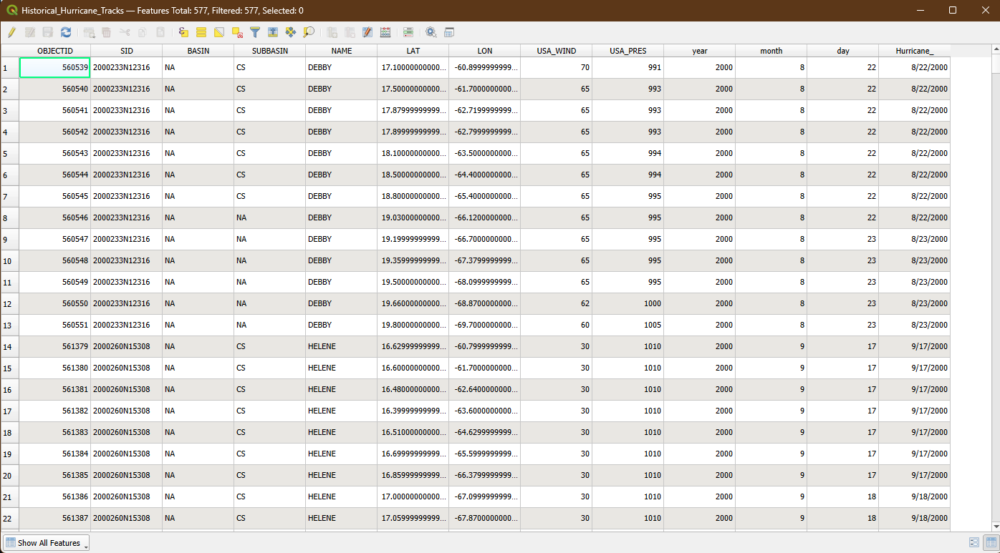

# PR_Hurricanes
Puerto Rico Hurricane Map Final

### Data Source

USDA Forestry data[Link to data source](https://www.fs.usda.gov/rds/archive/catalog/RDS-2018-0004)

ArcGIS Hub/NOAA data[Link to data source](https://hub.arcgis.com/datasets/d053e72aabfd4c5ab4139c3829c1e11c_0/explore?location=22.753037%2C-86.695325%2C4.12)

* Initial Data projection: EPSG 3857 - WGS 84
* Final Map projection: EPSG 32161 - NAD83 / Puerto Rico & Virgin Is.

### Purpose
Climate change is exacerbating severe weather across the globe and hurricanes are increasing in frequency and severity in the Caribbean. The purpose of this map is to illustrate the paths of hurricanes in Puerto Rico over the last twenty-two years and highlight the areas of most vulnerability on the island, specifically the major urban areas and protected natural areas. Although Puerto Rico is no stranger to hurricanes, it  should expect to manage weather patterns that are more intense in the coming years and mitigate heavy rainfall, flooding, and high winds.  

### Mapmaking Process
I sourced my initial hurricane shapefile through ArcGIS which used data from the National Oceanic and Atmospheric Administration.  After the shapefile was successfully imported I was able to filter the data to exclude those hurricanes which were unnamed (lesser strength) and removed hurricanes which were not in proximity to the area of interest around the island. 

Example of data import 

Example of attribute table from data import 

The hurricane track layer was fun to work with - I enjoyed using graduated symbology features to emphasize the strength of the hurricanes in QGIS. This process consisted of modifying both the color and the line width to distinguish the differences in hurricane wind speed. I attempted to use complementary colors between the lines and other map elements which took some trial and error. I then structured the shapefile layers in a way that was coherent and allowed the elements to be presented clearly without obstructing one another. Once the map graphic was finished, I entered into the layout where I finalized the arrangment of the map frame and the various attributes to utilize the full canvas. After more trial and error I decided to add a background mask to the text blocks to make them appear more legible against the background and separated the legend into it's two seperate categories: one for the hurricane tracks and one for the urban and nature centers. 

### Map summary

What are the key findings to take from your map and the overall mapmaking process?

Key findings demonstrate how urban and natural areas in the northeast quadrant of the island are the most susceptible to hurricanes in the last twenty-two years. These findings also provide insight on which urban areas can benefit most from the implementation of climate resilent infrastructure. Puerto Rico's vulnerability to climate change is exacerbated by existing vulnerabilities, such as systemic inequality and U.S. colonization. To build hurricane resilience, Puerto Rico will need to invest in stronger infrastructure, new technologies, and social and economic development.

## Final Project Link

 **[[Link to the final map](https://tlme234.github.io/PR_Hurricanes)]** 
